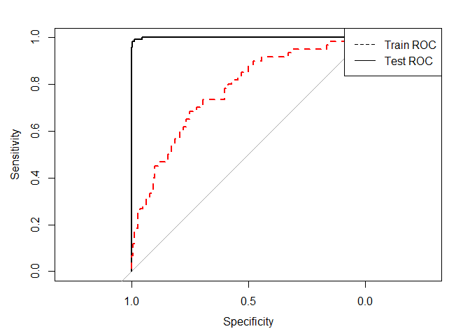
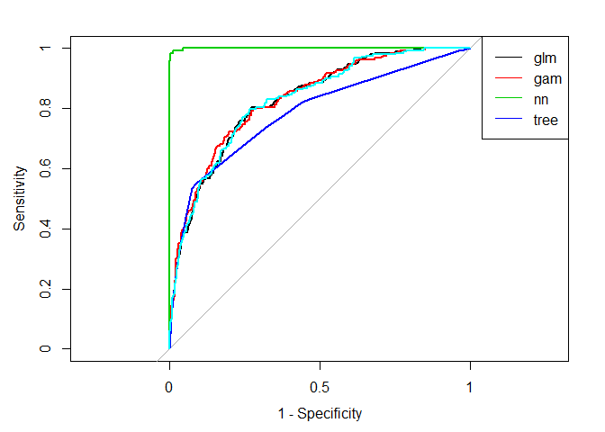

GermanCreditCardData
================
Krishna Chaitanya Vamaraju
March 19, 2018

EXECUTIVE SUMMARY
-----------------

The German credit data set is available at the UCI Machine Learning repository. It contains 1,000 samples that have been given labels of good and bad credit. In the data set, 70% were rated as having good credit.The baseline accuracy for the model is therefore 70% ,which is achieved by predicting all samples as good credit.A stratified random sample of 800 customers is drawn from the entire data set for training models. The remaining samples will be used as a test set to verify performance when a final model is determined.

``` r
library(MASS) #Boston Housing Data Set
library(dplyr) #Data Wrangling
library(tidyverse) #Data Wrangling
library(knitr) #Knitting RMDs and functionalities
library(reshape2) #Data Wrangling
library(ggplot2) #Data Visualization
library(GGally) #Data Visualization
library(boot) #Resampling methods
library(rpart) #Tree modeling
library(rattle)
library(mgcv) #GAM modeling
library(neuralnet) #Neural Networks Model
library(plyr) #Data Wrangling
library(caret) #Cross Validation for Neural Networks
```

The dataset loaded from `caret` package has all the factor varibales converted into dummy variables.First, remove near-zero variance predictors then get rid of a few predictors that duplicate values. For example, there are two possible values for the housing variable: "Rent", "Own" and "ForFree". So that we don't have linear dependencies, we get rid of one of the levels (e.g. "ForFree")

``` r
data(GermanCredit)
GermanCredit$Class <- as.factor(recode(GermanCredit$Class,Bad = 1,Good =0))
GermanCredit <- GermanCredit[, -nearZeroVar(GermanCredit)]
GermanCredit$CheckingAccountStatus.lt.0 <- NULL
GermanCredit$SavingsAccountBonds.lt.100 <- NULL
GermanCredit$EmploymentDuration.lt.1 <- NULL
GermanCredit$EmploymentDuration.Unemployed <- NULL
GermanCredit$Personal.Male.Married.Widowed <- NULL
GermanCredit$Property.Unknown <- NULL
GermanCredit$Housing.ForFree <- NULL
```

The data is split into training (80%) and test sets (20%) using stratified sampling

``` r
set.seed(100)
inTrain <- createDataPartition(GermanCredit$Class, p = .8)[[1]]
GermanCreditTrain <- GermanCredit[ inTrain, ]
GermanCreditTest  <- GermanCredit[-inTrain, ]
```

Logistic Regression
-------------------

``` r
fit.glm <- train(Class ~ .,
                    data = GermanCreditTrain,
                    method = "glm",
                    trControl = trainControl(method = "cv", number = 10),
                    family = "binomial")
fit.glm
```

    ## Generalized Linear Model 
    ## 
    ## 800 samples
    ##  41 predictor
    ##   2 classes: '0', '1' 
    ## 
    ## No pre-processing
    ## Resampling: Cross-Validated (10 fold) 
    ## Summary of sample sizes: 720, 720, 720, 720, 720, 720, ... 
    ## Resampling results:
    ## 
    ##   Accuracy  Kappa    
    ##   0.745     0.3608092

The Accuracy is 0.7085 for the logistic model.

``` r
library(pROC)
```

    ## Type 'citation("pROC")' for a citation.

    ## 
    ## Attaching package: 'pROC'

    ## The following objects are masked from 'package:stats':
    ## 
    ##     cov, smooth, var

``` r
creditResults <- data.frame(obs = GermanCreditTrain$Class)
creditResults$prob <- predict(fit.glm, type = "prob")[, "1"]
creditResults$pred <- predict(fit.glm)
creditResults$Label <- ifelse(creditResults$obs == 1, 
                              "True Outcome: Bad Credit", 
                              "True Outcome: Good Credit")
creditROC.train.glm <- roc(creditResults$obs, creditResults$prob)
```

Predictions on the test set :

``` r
creditResults <- data.frame(obs = GermanCreditTest$Class)
creditResults$prob <- predict(fit.glm, GermanCreditTest, type = "prob")[, "1"]
creditResults$pred <- predict(fit.glm, GermanCreditTest)
creditResults$Label <- ifelse(creditResults$obs == 1, 
                              "True Outcome: Bad Credit", 
                              "True Outcome: Good Credit")
glm.train.pred <- predict(fit.glm, type = "prob")
glm.test.pred <- predict(fit.glm, GermanCreditTest, type = "prob")
```

Plot of the probability of bad credit

``` r
histogram(~prob|Label,
          data = creditResults,
          layout = c(2, 1),
          nint = 20,
          xlab = "Probability of Bad Credit",
          type = "count")
```

 The plot provides information on where we can expect the Probabilities to fall.

Calculate and plot the calibration curve

``` r
creditCalib <- calibration(obs ~ prob, data = creditResults)
xyplot(creditCalib)
```


Confusion Matrix for the train data

``` r
pcut <- 1/6
prob.glm.in <- predict(fit.glm, type = "prob")[, "1"]
pred.glm.in <- (prob.glm.in >= pcut) * 1
prob.glm.out <- predict(fit.glm,GermanCreditTest, type = "prob")[, "1"]
pred.glm.out <- (prob.glm.out >= pcut) * 1
table(GermanCreditTrain$Class, pred.glm.in, dnn = c("Observation", "Prediction"))
```

    ##            Prediction
    ## Observation   0   1
    ##           0 302 258
    ##           1  29 211

Confusion Matrix for the Test Data :

``` r
table(GermanCreditTest$Class, pred.glm.out, dnn = c("Observation", "Prediction"))
```

    ##            Prediction
    ## Observation  0  1
    ##           0 73 67
    ##           1  8 52

Misclassification for the train data

``` r
(glm.mis.train <- mean(ifelse(GermanCreditTrain$Class != pred.glm.in, 1, 0)))
```

    ## [1] 0.35875

Misclassification for the test data

``` r
(glm.mis.test <-mean(ifelse(GermanCreditTest$Class != pred.glm.out, 1, 0)))
```

    ## [1] 0.375

Plotting ROC curves:

The ROC curves for the Train and Test Set :

``` r
creditROC.train.glm <- roc(GermanCreditTrain$Class=="1",prob.glm.in)
creditROC.test.glm <- roc(GermanCreditTest$Class=="1",prob.glm.out)
plot(creditROC.train.glm)
plot(creditROC.test.glm,,add=TRUE,lty = "dashed",col = "red")
legend("topright",legend=c("Train ROC","Test ROC"),
       lty=c("dashed","solid"))
```


Lift chart for the Logistic Regression Model :

``` r
creditLift <- lift(obs ~ prob, data = creditResults)
xyplot(creditLift)
```


Fitting GAM to the Credit Card Data
-----------------------------------

``` r
require(mgcv)
gam.formula <- as.formula(paste("Class~ s(Amount)+s(InstallmentRatePercentage)+s(ResidenceDuration)+s(Age)+",paste0(names(GermanCreditTrain)[6:42],collapse  = "+")))


fit.gam <- gam(Class ~ s(Duration,k=4)+s(Amount,k=4) + InstallmentRatePercentage + s(ResidenceDuration,k=4)+s(Age,k =4) + s(NumberExistingCredits,k=4) + NumberPeopleMaintenance + 
    Telephone + CheckingAccountStatus.0.to.200 + CheckingAccountStatus.gt.200 +     CheckingAccountStatus.none + CreditHistory.PaidDuly + CreditHistory.Delay + 
    CreditHistory.Critical + Purpose.NewCar + Purpose.UsedCar + 
    Purpose.Furniture.Equipment + Purpose.Radio.Television + 
    Purpose.Education + Purpose.Business + SavingsAccountBonds.100.to.500 + 
    SavingsAccountBonds.500.to.1000 + SavingsAccountBonds.Unknown + 
    EmploymentDuration.1.to.4 + EmploymentDuration.4.to.7 + EmploymentDuration.gt.7 + 
    Personal.Male.Divorced.Seperated + Personal.Female.NotSingle + 
    Personal.Male.Single + OtherDebtorsGuarantors.None +
      OtherDebtorsGuarantors.Guarantor + 
      Property.RealEstate + Property.Insurance + Property.CarOther +
      OtherInstallmentPlans.Bank + OtherInstallmentPlans.None +
      Housing.Rent + Housing.Own + Job.UnskilledResident + Job.SkilledEmployee +
      Job.Management.SelfEmp.HighlyQualified ,family = binomial,data = GermanCreditTrain)

# fit.gam <- train(gam.formula,
#                      data = GermanCreditTrain,
#                      method = "gam",
#                      family = "binomial",
#                      trControl = trainControl(method = "cv", 
#                                               number = 10),weights = model_weights)
fit.gam
```

    ## 
    ## Family: binomial 
    ## Link function: logit 
    ## 
    ## Formula:
    ## Class ~ s(Duration, k = 4) + s(Amount, k = 4) + InstallmentRatePercentage + 
    ##     s(ResidenceDuration, k = 4) + s(Age, k = 4) + s(NumberExistingCredits, 
    ##     k = 4) + NumberPeopleMaintenance + Telephone + CheckingAccountStatus.0.to.200 + 
    ##     CheckingAccountStatus.gt.200 + CheckingAccountStatus.none + 
    ##     CreditHistory.PaidDuly + CreditHistory.Delay + CreditHistory.Critical + 
    ##     Purpose.NewCar + Purpose.UsedCar + Purpose.Furniture.Equipment + 
    ##     Purpose.Radio.Television + Purpose.Education + Purpose.Business + 
    ##     SavingsAccountBonds.100.to.500 + SavingsAccountBonds.500.to.1000 + 
    ##     SavingsAccountBonds.Unknown + EmploymentDuration.1.to.4 + 
    ##     EmploymentDuration.4.to.7 + EmploymentDuration.gt.7 + Personal.Male.Divorced.Seperated + 
    ##     Personal.Female.NotSingle + Personal.Male.Single + OtherDebtorsGuarantors.None + 
    ##     OtherDebtorsGuarantors.Guarantor + Property.RealEstate + 
    ##     Property.Insurance + Property.CarOther + OtherInstallmentPlans.Bank + 
    ##     OtherInstallmentPlans.None + Housing.Rent + Housing.Own + 
    ##     Job.UnskilledResident + Job.SkilledEmployee + Job.Management.SelfEmp.HighlyQualified
    ## 
    ## Estimated degrees of freedom:
    ## 1.09 1.66 2.40 1.00 1.00  total = 44.15 
    ## 
    ## UBRE score: 0.008451387

Partial Residual Plot functions from the GAM fit.

``` r
plot(fit.gam,scale=0,se=2,shade=TRUE,pages=1)
```


Confusion Matrix on the Train data

``` r
pcut.gam <- 1/6
prob.gam.in <- predict(fit.gam, type = "response")
pred.gam.in <- (prob.gam.in >= pcut.gam) * 1
prob.gam.out <- predict(fit.gam,GermanCreditTest, type = "response")
pred.gam.out <- (prob.gam.out >= pcut) * 1
table(GermanCreditTrain$Class, pred.gam.in, dnn = c("Observation", "Prediction"))
```

    ##            Prediction
    ## Observation   0   1
    ##           0 305 255
    ##           1  29 211

Misclassification rate on the Train Data is :-

``` r
(gam.mis.train <- mean(ifelse(GermanCreditTrain$Class != pred.gam.in, 1, 0)))
```

    ## [1] 0.355

Confusion Matrix for the Test Data :

``` r
table(GermanCreditTest$Class, pred.gam.out, dnn = c("Observation", "Prediction"))
```

    ##            Prediction
    ## Observation  0  1
    ##           0 77 63
    ##           1  9 51

Misclassification for the test data

``` r
(gam.mis.test <- mean(ifelse(GermanCreditTest$Class != pred.gam.out, 1, 0)))
```

    ## [1] 0.36

Plot of probability of bad credit

``` r
histogram(~prob|Label,
          data = creditResults,
          layout = c(2, 1),
          nint = 20,
          xlab = "Probability of Bad Credit",
          type = "count")
```


Calculate and plot the calibration curve

``` r
creditCalib <- calibration(obs ~ prob, data = creditResults)
xyplot(creditCalib)
```


ROC curves:

``` r
creditROC.train.gam <- roc(GermanCreditTrain$Class=="1",prob.gam.in)
creditROC.test.gam <- roc(GermanCreditTest$Class=="1",prob.gam.out)
plot(creditROC.train.gam)
plot(creditROC.test.gam,,add=TRUE,lty = "dashed",col = "red")
legend("topright",legend=c("Train ROC","Test ROC"),
       lty=c("dashed","solid"))
```


Lift charts

``` r
creditLift <- lift(obs ~ prob, data = creditResults)
xyplot(creditLift)
```


Neural Network on the German Credit card Data
---------------------------------------------

``` r
nnetGrid <- expand.grid(decay = c(0, 0.01, .1), 
                        size = c(1, 3, 5, 7, 9, 11, 13), 
                        bag = FALSE)

set.seed(100)
fit.nn <- train(Class ~ .,
                  data = GermanCreditTrain,
                  method = "avNNet",
                  trControl = trainControl(method = "cv", number = 2),
                  preProc = c("center", "scale"),
                  linout = TRUE,
                  trace = FALSE,
                  maxit = 1000,
                  allowParallel = FALSE
                    )
fit.nn
```

    ## Model Averaged Neural Network 
    ## 
    ## 800 samples
    ##  41 predictor
    ##   2 classes: '0', '1' 
    ## 
    ## Pre-processing: centered (41), scaled (41) 
    ## Resampling: Cross-Validated (2 fold) 
    ## Summary of sample sizes: 400, 400 
    ## Resampling results across tuning parameters:
    ## 
    ##   size  decay  Accuracy  Kappa    
    ##   1     0e+00  0.72500   0.3163908
    ##   1     1e-04  0.72375   0.3039334
    ##   1     1e-01  0.71125   0.2868785
    ##   3     0e+00  0.71500   0.3030314
    ##   3     1e-04  0.71875   0.3255212
    ##   3     1e-01  0.69750   0.2594852
    ##   5     0e+00  0.68750   0.2866451
    ##   5     1e-04  0.73500   0.3602626
    ##   5     1e-01  0.72500   0.3410079
    ## 
    ## Tuning parameter 'bag' was held constant at a value of FALSE
    ## Accuracy was used to select the optimal model using the largest value.
    ## The final values used for the model were size = 5, decay = 1e-04 and bag
    ##  = FALSE.

``` r
### Predict the train set
creditResults <- data.frame(obs = GermanCreditTrain$Class)
creditResults$prob <- predict(fit.nn, type = "prob")[, "1"]
creditResults$pred <- predict(fit.nn)
creditResults$Label <- ifelse(creditResults$obs == 1, 
                              "True Outcome: Bad Credit", 
                              "True Outcome: Good Credit")
creditROC.train.nn <- roc(creditResults$obs, creditResults$prob)
```

``` r
### Predict the test set
creditResults <- data.frame(obs = GermanCreditTest$Class)
creditResults$prob <- predict(fit.nn, GermanCreditTest, type = "prob")[, "1"]
creditResults$pred <- predict(fit.nn, GermanCreditTest)
creditResults$Label <- ifelse(creditResults$obs == 1, 
                              "True Outcome: Bad Credit", 
                              "True Outcome: Good Credit")
```

Probability of bad credit

``` r
histogram(~prob|Label,
          data = creditResults,
          layout = c(2, 1),
          nint = 20,
          xlab = "Probability of Bad Credit",
          type = "count")
```


Calculate and plot the calibration curve

``` r
creditCalib <- calibration(obs ~ prob, data = creditResults)
xyplot(creditCalib)
```


Confusion Matrix for the train data

``` r
pcut <- 1/6
prob.nn.in <- predict(fit.nn, type = "prob")[, "1"]
pred.nn.in <- (prob.nn.in >= pcut) * 1
prob.nn.out <- predict(fit.nn,GermanCreditTest, type = "prob")[, "1"]
pred.nn.out <- (prob.nn.out >= pcut) * 1
table(GermanCreditTrain$Class, pred.nn.in, dnn = c("Observation", "Prediction"))
```

    ##            Prediction
    ## Observation   0   1
    ##           0 440 120
    ##           1   0 240

Confusion Matrix for the Test Data :

``` r
table(GermanCreditTest$Class, pred.nn.out, dnn = c("Observation", "Prediction"))
```

    ##            Prediction
    ## Observation  0  1
    ##           0 74 66
    ##           1  9 51

Misclassification for the train data

``` r
(nn.mis.train <-mean(ifelse(GermanCreditTrain$Class != pred.nn.in, 1, 0)))
```

    ## [1] 0.15

Misclassification for the test data

``` r
(nn.mis.test <- mean(ifelse(GermanCreditTest$Class != pred.nn.out, 1, 0)))
```

    ## [1] 0.375

ROC curves:

``` r
creditROC.train.nn<- roc(GermanCreditTrain$Class=="1",prob.nn.in)
creditROC.test.nn <- roc(GermanCreditTest$Class=="1",prob.nn.out)
plot(creditROC.train.nn)
plot(creditROC.test.nn,add=TRUE,lty = "dashed",col = "red")
legend("topright",legend=c("Train ROC","Test ROC"),
       lty=c("dashed","solid"))
```



ROC Curve for the Neural network model :

``` r
plot(creditROC.test.nn, legacy.axes = TRUE,lty = "solid")
plot(creditROC.train.nn,legacy.axes = TRUE,add=TRUE,lty = "dashed",col = "red")
legend("topright",legend=c("Train ROC","Test ROC"),
       lty=c("dashed","solid"))
```

 As expected the difference between train and test ROC's is higher for Neural networks.Neural network can only be used if they are properly tuned so that they don't overfit the training data.

Lift charts for the neural network model :

``` r
creditLift <- lift(obs ~ prob, data = creditResults)
xyplot(creditLift)
```


Classification Tree on the German Credit card Data
--------------------------------------------------

The method used to fit the data is `rpart` and the model is built using Cross-Validation to find the optimum Cp.The results of the Regression Tree are as follows :

``` r
fit.tree <- train(Class ~ .,
                        data = GermanCreditTrain,
                        method = "rpart",
                        tuneLength = 30,
                        trControl =trainControl(method = "cv", number = 10) 
                        )
 
library(party)
```

    ## Loading required package: grid

    ## Loading required package: mvtnorm

    ## Loading required package: modeltools

    ## Loading required package: stats4

    ## 
    ## Attaching package: 'modeltools'

    ## The following object is masked from 'package:plyr':
    ## 
    ##     empty

    ## Loading required package: strucchange

    ## Loading required package: zoo

    ## 
    ## Attaching package: 'zoo'

    ## The following objects are masked from 'package:base':
    ## 
    ##     as.Date, as.Date.numeric

    ## Loading required package: sandwich

    ## 
    ## Attaching package: 'strucchange'

    ## The following object is masked from 'package:stringr':
    ## 
    ##     boundary

``` r
library(rattle)
fancyRpartPlot(fit.tree$finalModel)
```


Summary of the Tree fit

``` r
fit.tree
```

    ## CART 
    ## 
    ## 800 samples
    ##  41 predictor
    ##   2 classes: '0', '1' 
    ## 
    ## No pre-processing
    ## Resampling: Cross-Validated (10 fold) 
    ## Summary of sample sizes: 720, 720, 720, 720, 720, 720, ... 
    ## Resampling results across tuning parameters:
    ## 
    ##   cp           Accuracy  Kappa     
    ##   0.000000000  0.71250   0.28083559
    ##   0.001508621  0.71250   0.28083559
    ##   0.003017241  0.72250   0.29847246
    ##   0.004525862  0.72250   0.30113961
    ##   0.006034483  0.73500   0.32762546
    ##   0.007543103  0.73625   0.32619693
    ##   0.009051724  0.73625   0.32698759
    ##   0.010560345  0.73500   0.30916853
    ##   0.012068966  0.73000   0.28490141
    ##   0.013577586  0.72375   0.25521895
    ##   0.015086207  0.72750   0.26701126
    ##   0.016594828  0.72250   0.24470315
    ##   0.018103448  0.72250   0.24470315
    ##   0.019612069  0.71750   0.24263541
    ##   0.021120690  0.71375   0.21526493
    ##   0.022629310  0.71375   0.21526493
    ##   0.024137931  0.71125   0.22042346
    ##   0.025646552  0.71125   0.21626546
    ##   0.027155172  0.71125   0.21626546
    ##   0.028663793  0.71375   0.22270225
    ##   0.030172414  0.71375   0.22270225
    ##   0.031681034  0.71125   0.21781022
    ##   0.033189655  0.71125   0.21781022
    ##   0.034698276  0.71125   0.21781022
    ##   0.036206897  0.71125   0.21781022
    ##   0.037715517  0.69875   0.11266467
    ##   0.039224138  0.69875   0.11266467
    ##   0.040732759  0.69375   0.07676723
    ##   0.042241379  0.69375   0.07920717
    ##   0.043750000  0.69625   0.07479541
    ## 
    ## Accuracy was used to select the optimal model using the largest value.
    ## The final value used for the model was cp = 0.009051724.

``` r
### Predict the train set
creditResults <- data.frame(obs = GermanCreditTrain$Class)
creditResults$prob <- predict(fit.tree, type = "prob")[, "1"]
creditResults$pred <- predict(fit.tree)
creditResults$Label <- ifelse(creditResults$obs == 1, 
                              "True Outcome: Bad Credit", 
                              "True Outcome: Good Credit")
creditROC.train.tree<- roc(creditResults$obs, creditResults$prob)
```

``` r
### Predict the test set
creditResults <- data.frame(obs = GermanCreditTest$Class)
creditResults$prob <- predict(fit.tree, GermanCreditTest, type = "prob")[, "1"]
creditResults$pred <- predict(fit.tree, GermanCreditTest)
creditResults$Label <- ifelse(creditResults$obs == 1, 
                              "True Outcome: Bad Credit", 
                              "True Outcome: Good Credit")
```

Probability plot of bad credit on the Test Set :

``` r
histogram(~prob|Label,
          data = creditResults,
          layout = c(2, 1),
          nint = 20,
          xlab = "Probability of Bad Credit",
          type = "count")
```


plot of the calibration curve

``` r
creditCalib <- calibration(obs ~ prob, data = creditResults)
xyplot(creditCalib)
```


ROC curves:

``` r
creditROC.test.tree <- roc(creditResults$obs, creditResults$prob)
(auc.tree <- auc(creditROC.test.tree))
```

    ## Area under the curve: 0.7194

``` r
plot(creditROC.test.tree, legacy.axes = TRUE,lty = "solid")
plot(creditROC.train.tree,legacy.axes = TRUE,add=TRUE,lty = "dashed",col = "red")
legend("topright",legend=c("Train ROC","Test ROC"),
       lty=c("dashed","solid"))
```


Lift charts

``` r
creditLift <- lift(obs ~ prob, data = creditResults)
xyplot(creditLift)
```

 Confusion Matrix for the train data

``` r
pcut <- 1/6
prob.tree.in <- predict(fit.tree, type = "prob")[, "1"]
pred.tree.in <- (prob.tree.in >= pcut) * 1
prob.tree.out <- predict(fit.tree,GermanCreditTest, type = "prob")[, "1"]
pred.tree.out <- (prob.tree.out >= pcut) * 1
table(GermanCreditTrain$Class, pred.tree.in, dnn = c("Observation", "Prediction"))
```

    ##            Prediction
    ## Observation   0   1
    ##           0 300 260
    ##           1  41 199

Confusion Matrix for the Test Data :

``` r
table(GermanCreditTest$Class, pred.tree.out, dnn = c("Observation", "Prediction"))
```

    ##            Prediction
    ## Observation  0  1
    ##           0 74 66
    ##           1 10 50

Misclassification for the train data

``` r
(tree.mis.train <-mean(ifelse(GermanCreditTrain$Class != pred.tree.in, 1, 0)))
```

    ## [1] 0.37625

Misclassification for the test data

``` r
(tree.mis.test <- mean(ifelse(GermanCreditTest$Class != pred.tree.out, 1, 0)))
```

    ## [1] 0.38

Linear Discriminant Analysis
----------------------------

Summary of the LDA fit :

``` r
fit.lda <- lda(Class ~ ., data = GermanCreditTrain)
fit.lda
```

    ## Call:
    ## lda(Class ~ ., data = GermanCreditTrain)
    ## 
    ## Prior probabilities of groups:
    ##   0   1 
    ## 0.7 0.3 
    ## 
    ## Group means:
    ##   Duration   Amount InstallmentRatePercentage ResidenceDuration      Age
    ## 0 19.02500 2969.945                  2.894643          2.833929 36.08393
    ## 1 24.67083 3844.762                  3.137500          2.808333 33.81667
    ##   NumberExistingCredits NumberPeopleMaintenance Telephone
    ## 0                1.4125                1.157143 0.5839286
    ## 1                1.3375                1.162500 0.6166667
    ##   CheckingAccountStatus.0.to.200 CheckingAccountStatus.gt.200
    ## 0                      0.2285714                   0.06964286
    ## 1                      0.3500000                   0.05000000
    ##   CheckingAccountStatus.none CreditHistory.PaidDuly CreditHistory.Delay
    ## 0                  0.4982143              0.5178571          0.08214286
    ## 1                  0.1625000              0.5750000          0.08750000
    ##   CreditHistory.Critical Purpose.NewCar Purpose.UsedCar
    ## 0              0.3428571      0.2089286       0.1267857
    ## 1              0.1500000      0.2875000       0.0500000
    ##   Purpose.Furniture.Equipment Purpose.Radio.Television Purpose.Education
    ## 0                   0.1767857                0.3035714        0.03571429
    ## 1                   0.2041667                0.2125000        0.07083333
    ##   Purpose.Business SavingsAccountBonds.100.to.500
    ## 0       0.09464286                     0.09285714
    ## 1       0.11666667                     0.11666667
    ##   SavingsAccountBonds.500.to.1000 SavingsAccountBonds.Unknown
    ## 0                      0.07678571                   0.2035714
    ## 1                      0.03333333                   0.1125000
    ##   EmploymentDuration.1.to.4 EmploymentDuration.4.to.7
    ## 0                 0.3321429                 0.1839286
    ## 1                 0.3583333                 0.1125000
    ##   EmploymentDuration.gt.7 Personal.Male.Divorced.Seperated
    ## 0               0.2732143                       0.04821429
    ## 1               0.2166667                       0.06250000
    ##   Personal.Female.NotSingle Personal.Male.Single
    ## 0                 0.2857143            0.5589286
    ## 1                 0.3791667            0.4875000
    ##   OtherDebtorsGuarantors.None OtherDebtorsGuarantors.Guarantor
    ## 0                   0.9125000                       0.05714286
    ## 1                   0.9166667                       0.02500000
    ##   Property.RealEstate Property.Insurance Property.CarOther
    ## 0           0.3392857          0.2250000         0.3107143
    ## 1           0.2041667          0.2291667         0.3458333
    ##   OtherInstallmentPlans.Bank OtherInstallmentPlans.None Housing.Rent
    ## 0                     0.1250                  0.8410714    0.1607143
    ## 1                     0.1875                  0.7541667    0.2166667
    ##   Housing.Own Job.UnskilledResident Job.SkilledEmployee
    ## 0   0.7446429             0.2071429           0.6321429
    ## 1   0.6458333             0.1958333           0.5916667
    ##   Job.Management.SelfEmp.HighlyQualified
    ## 0                              0.1410714
    ## 1                              0.1875000
    ## 
    ## Coefficients of linear discriminants:
    ##                                                  LD1
    ## Duration                                2.646725e-02
    ## Amount                                  7.211093e-05
    ## InstallmentRatePercentage               2.702057e-01
    ## ResidenceDuration                       1.858113e-02
    ## Age                                    -1.100010e-02
    ## NumberExistingCredits                   2.344936e-01
    ## NumberPeopleMaintenance                 1.737919e-01
    ## Telephone                               1.310595e-01
    ## CheckingAccountStatus.0.to.200         -3.426575e-01
    ## CheckingAccountStatus.gt.200           -8.865177e-01
    ## CheckingAccountStatus.none             -1.278255e+00
    ## CreditHistory.PaidDuly                 -7.246420e-01
    ## CreditHistory.Delay                    -8.591385e-01
    ## CreditHistory.Critical                 -1.460209e+00
    ## Purpose.NewCar                          6.538172e-01
    ## Purpose.UsedCar                        -6.138331e-01
    ## Purpose.Furniture.Equipment             1.705048e-01
    ## Purpose.Radio.Television                1.048470e-01
    ## Purpose.Education                       9.317662e-01
    ## Purpose.Business                        2.981516e-02
    ## SavingsAccountBonds.100.to.500         -1.907986e-01
    ## SavingsAccountBonds.500.to.1000        -3.209368e-01
    ## SavingsAccountBonds.Unknown            -3.968567e-01
    ## EmploymentDuration.1.to.4              -4.069730e-02
    ## EmploymentDuration.4.to.7              -5.898313e-01
    ## EmploymentDuration.gt.7                -1.632188e-01
    ## Personal.Male.Divorced.Seperated        4.278951e-01
    ## Personal.Female.NotSingle               3.669227e-01
    ## Personal.Male.Single                   -2.557605e-02
    ## OtherDebtorsGuarantors.None            -3.295473e-01
    ## OtherDebtorsGuarantors.Guarantor       -1.257851e+00
    ## Property.RealEstate                    -8.647683e-01
    ## Property.Insurance                     -6.485638e-01
    ## Property.CarOther                      -5.780037e-01
    ## OtherInstallmentPlans.Bank             -2.784060e-01
    ## OtherInstallmentPlans.None             -5.103415e-01
    ## Housing.Rent                            7.716909e-01
    ## Housing.Own                             5.582327e-01
    ## Job.UnskilledResident                   1.727134e-01
    ## Job.SkilledEmployee                     2.006878e-01
    ## Job.Management.SelfEmp.HighlyQualified  2.229119e-01

Confusion Matrix for the Train Data :

``` r
prob.lda.in <- predict(fit.lda, data = GermanCreditTrain)
pcut.lda <- 1/6
pred.lda.in <- (prob.lda.in$posterior[, 2] >= pcut.lda) * 1
table(GermanCreditTrain$Class, pred.lda.in, dnn = c("Obs", "Pred"))
```

    ##    Pred
    ## Obs   0   1
    ##   0 310 250
    ##   1  32 208

Confusion Matrix for the Testing Data

``` r
prob.lda.out<- predict(fit.lda, GermanCreditTest)
pred.lda.out <- (prob.lda.out$posterior[, 2] >= pcut.lda) * 1
table(GermanCreditTest$Class, pred.lda.out, dnn = c("Obs", "Pred"))
```

    ##    Pred
    ## Obs  0  1
    ##   0 76 64
    ##   1  8 52

Misclassification Rate for In-Sample

``` r
(mis.lda.in <- mean(ifelse(GermanCreditTrain$Class != pred.lda.in, 1, 0)))
```

    ## [1] 0.3525

Misclassification Rate for Out-of-Sample

``` r
(mis.lda.out <- mean(ifelse(GermanCreditTest$Class != pred.lda.out, 1, 0)))
```

    ## [1] 0.36

ROC Curve for Linear Discriminant Analysis:

``` r
creditROC.train.lda<- roc(GermanCreditTrain$Class=="1",prob.lda.in$posterior[, 2])
creditROC.test.lda <- roc(GermanCreditTest$Class=="1",prob.lda.out$posterior[, 2])
plot(creditROC.train.lda)
plot(creditROC.test.lda,add=TRUE,lty = "dashed",col = "red")
legend("topright",legend=c("Train ROC","Test ROC"),
       lty=c("dashed","solid"))
```


Model Comparision
-----------------

Plot of the ROC Curves on the Train Data and the Test Data

``` r
plot(creditROC.train.glm, legacy.axes = TRUE,lty = "solid",col=1)
plot(creditROC.train.gam, legacy.axes = TRUE,lty = "solid",add= TRUE,col=2)
plot(creditROC.train.nn, legacy.axes = TRUE,lty = "solid",add= TRUE,col=3)
plot(creditROC.train.tree, legacy.axes = TRUE,lty = "solid",add= TRUE,col=4)
plot(creditROC.train.lda, legacy.axes = TRUE,lty = "solid",add= TRUE,col=5)
legend("topright",legend=c("glm","gam","nn","tree"),
       lty="solid",col=1:4)
```



It can be clearly seen that the `Neural networks` have the highest `AUC` for the Train Data with the Tree being the least followed by both `glm` and `gam`.

``` r
plot(creditROC.test.glm, legacy.axes = TRUE,lty = "solid",col=1)
plot(creditROC.test.gam, legacy.axes = TRUE,lty = "solid",add= TRUE,col=2)
plot(creditROC.test.nn, legacy.axes = TRUE,lty = "solid",add= TRUE,col=3)
plot(creditROC.test.tree, legacy.axes = TRUE,lty = "solid",add= TRUE,col=4)
plot(creditROC.test.lda, legacy.axes = TRUE,lty = "solid",add= TRUE,col=4)
legend("topright",legend=c("glm","gam","nn","tree"),
       lty="solid",col=1:4)
```

 For the TestData the `GAM` has the highest `AUC` with the least being the `Tree`.

Plot of the Misclassification Rates on the Train and Test Data :

``` r
mis_train <- c(glm.mis.train,nn.mis.train,tree.mis.train,gam.mis.train,mis.lda.in)
mis_test <-  c(glm.mis.test,nn.mis.test,tree.mis.test,gam.mis.test,mis.lda.out)
plot(1:5,mis_train,xaxt="n",type="b")
lines(mis_test,type="b",col="red",lty="dashed")
axis(1, at=1:5, labels=c("glm","nn","tree","gam","lda"))
legend("bottomright",legend=c("Out of Sample Misclassification ","In Sample Misclassification"),
       lty=c("dashed","solid"))
```

 It can be observed here that the Neural Networks gave the lowest Misclassification on both the test and the Train .Also,the trees ,GAM and LDA gave the highest misclassification also poor generalization to the data.
